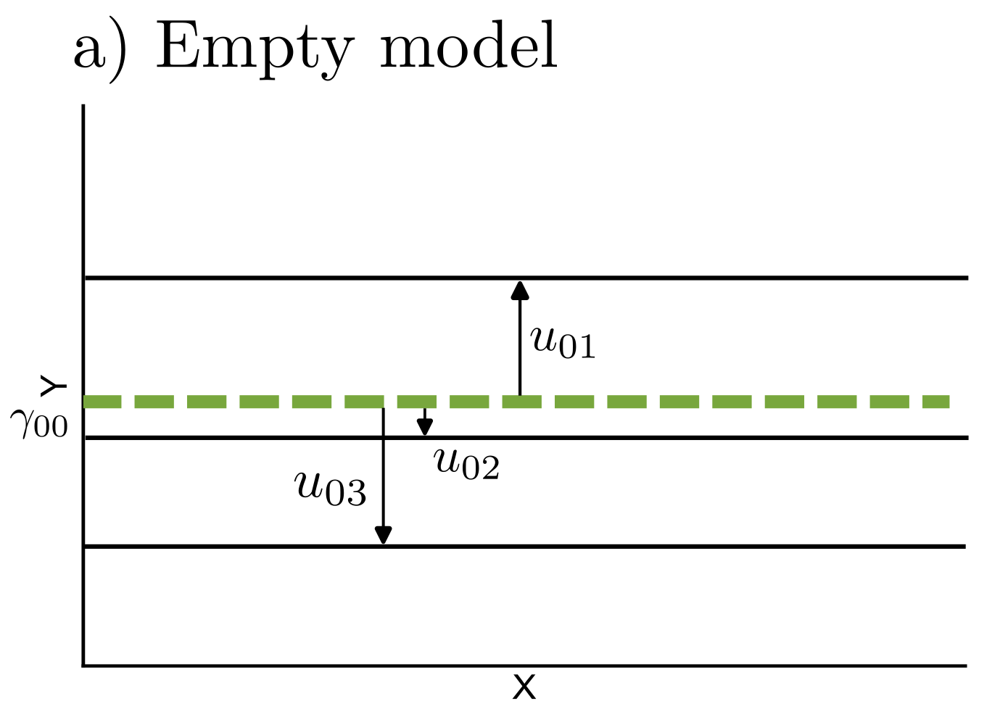
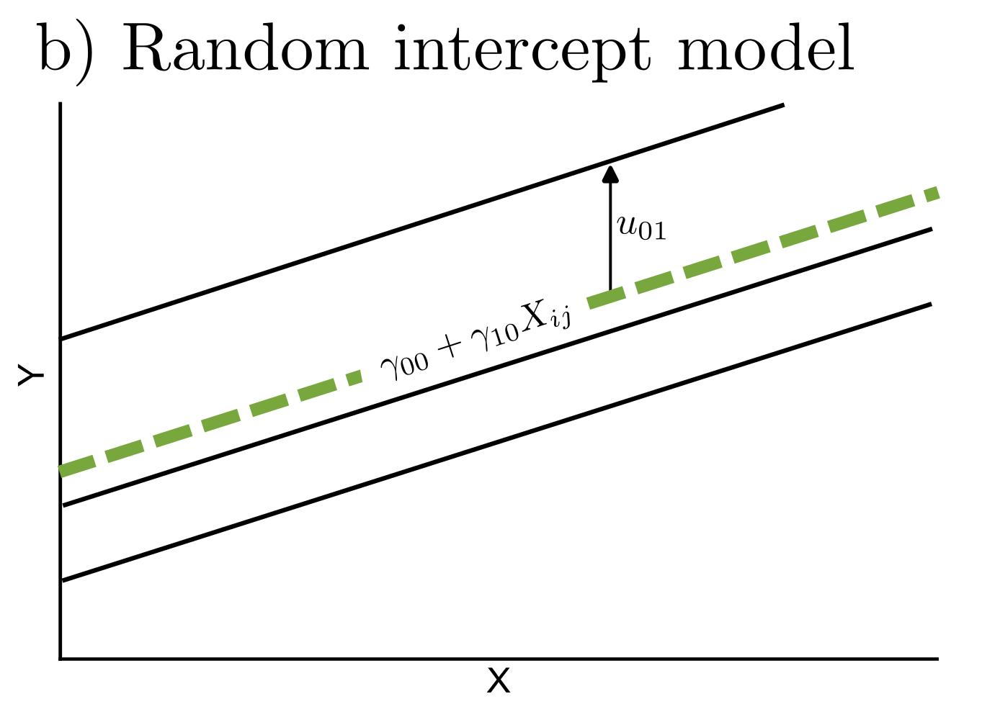
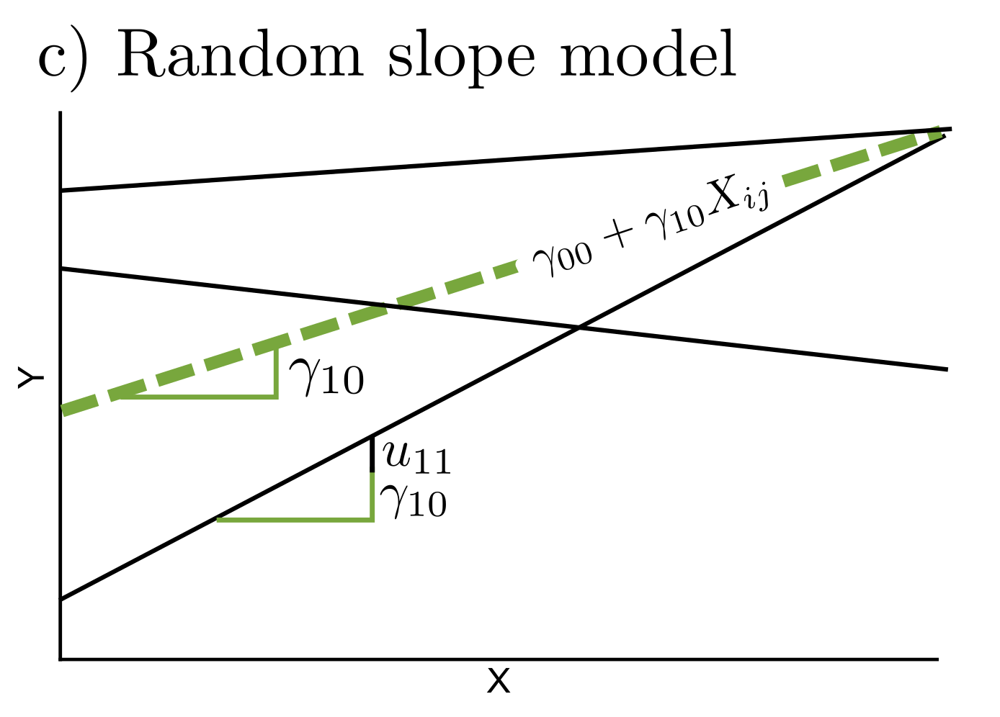

## Theoretical foundation of multilevel models

::: {.callout-tip title="Example" appearance="default" icon=false}
Imagine you are interested in the musical self-concept of young adults and whether it is related to how many hours they practice their instrument each week. To investigate this question, you collect data from several youth ensembles. You recruit 15 ensembles, each consisting of 10 players. Every player completes a questionnaire assessing their musical self-concept as well as their weekly practice time.  
At first glance, this seems like a simple data set of 150 individuals. But is it really that simple?  
Players from the same ensemble rehearse together, share teachers, and experience similar social and musical environments. Their responses may therefore be more similar within ensembles than between ensembles.
:::

Populations like this are common in the social sciences. Units of interest (e.g., students, employees, musicians) are grouped into higher-level units such as classes, firms, or ensembles.
The resulting data is called *nested* or *clustered* [@snijders, p. 7]. From a sampling perspective, such data often arise from a multistage sampling process, in which groups are sampled first and individuals are subsequently sampled within these groups^[In this thesis, the terms 'groups' or 'clusters' refer to higher-level units, while lower-level units are referred to as 'persons', 'individuals' or 'observations'. These models can also be applied to longitudinal data, where measurement occasions are nested within individuals, and to data structures with more than two levels.]. This process induces dependencies in the data, as observations within the same group are not selected independently. Beyond the sampling process, individuals within the same group typically share contextual influences (e.g., the same ensemble teacher or classroom environment), which leads to increased similarity in their responses. As a consequence, the assumption of independent errors in traditional linear models is violated, because residuals within groups are correlated [@raudenbush, p. xx]. A widely used approach to account for this structure is the use of *multilevel models* (also referred to as *hierarchical linear models* or *mixed models*), which are introduced in the following section.

### The concept of multilevel regression models
The aim of regression analysis, whether single- or multilevel, is to explain variance in an outcome variable by including associated variables in the model as predictors [@snijders, p. 80]. In single-level regression, the residual $e_{i}$ captures the unexplained variance in $Y$, that is differences in the outcome from the prediction that the model made [@leonhart, p. 319]. The assumption of the classical linear model is that after inclusion of all systematic influences on $Y$, the residuals are random. Specifically, they are assumed to have expectation zero ($E(e_i)=0$), constant variance across observations (homoscedasticity; $Var(e_i)=\sigma^2$), and to be independent across observations ($Cov(e_i, e_{i'})=0$ for $i \neq i'$) [@fahrmeir, p.87].  
Multilevel models extend regular linear regression by adding level-2 random effects to explain the variability between groups that cannot be accounted for by predictors [@snijders, p. 80]. This partition of variance can be expressed in the multilevel regression model without predictors, the *empty model*:

$$
Y_{ij} = \gamma_{00} + u_{0j} + e_{ij}
$$
Here, the outcome value of person $i$ in group $j$ is modeled as the sum of the overall mean $\gamma_{00}$, a group level random effect $u_{0j}$ and an individual-level residual, $e_{ij}$ [@snijders, p. 49]. The random intercept $u_{0j}$ captures the dependency of individuals within one group statistically, as all individuals in group $j$ have the same $u_{0j}$ value and their outcome values are therefore correlated. Conditional on this group component, however, the remaining level-1 residuals $e_{ij}$ are assumed to be independent, addressing the issue of dependency that would arise if a single-level regression model were applied to nested data.

This and the models explained below are illustrated in @fig-mlmplots.

::: {#fig-mlmplots layout-ncol=3}
{}

{}

{}

Schematic illustration of common multilevel model specifications in coordinate space: empty model, random intercept model, and random slope model. The green line represents the fixed-effect prediction averaged across groups. The black lines represent exemplary groups and their deviations from the fixed effects. Individual-level observations are not displayed.

:::

### Within- and between- group regressions and inclusion of predictors

Predictors can then be included to explain variability within groups (level 1) and between groups (level 2).  
At level 1, the outcome of a person $i$ in group $j$ is modeled as a function of individual-level explanatory variables $X_{ij}$ to obtain the within-group regression model. For simplicity, the model is illustrated with a single level-1 predictor:

$$
Y_{ij} =  \beta_{0j} + \beta_{1j}X_{ij} + e_{ij}
$$ {#eq-mlm}

At level 2, the variation between groups in the group-dependent coefficients $\beta_{0j}$ and $\beta_{1j}$ is modeled. In a random coefficients model, each group is allowed to have its own intercept and slope. These coefficients can be separated into a fixed part (the average coefficient across groups) and a random deviation from this average [@snijders, p. 75]. Without level-2 predictors:
$$
\beta_{0j}
=
\underbrace{\gamma_{00}}_{\text{Fixed part}}
+
\underbrace{u_{0j}}_{\text{Random part}}
$$
$$
\beta_{1j}
=
\underbrace{\gamma_{10}}_{\text{Fixed part}}
+
\underbrace{u_{1j}}_{\text{Random part}}
$$
On this level, in order to explain between-group variability in the intercepts and slopes, level-2 predictors $Z_j$ may be included [@snijders, p. 80]. Including such predictors may reduce the unexplained variance of the random effects $u_{0j}$ and $u_{1j}$. With a single level-2 predictor, the model becomes:

$$
\beta_{0j}
=
\gamma_{00} + \gamma_{01}Z_{j}
+
u_{0j}
$$ {#eq-beta0j}

$$
\beta_{1j}
=
\gamma_{10} + \gamma_{11}Z_{j}
+
u_{1j}
$$ {#eq-beta1j}

Substituting the level-2 equations @eq-beta0j and @eq-beta1j into the level-1 model @eq-mlm yields the combined multilevel model:

$$
Y_{ij} =
\underbrace{\gamma_{00} + \gamma_{10}X_{ij} + \gamma_{01}Z_{j} + \gamma_{11}X_{ij}Z_{j}}_{\text{Fixed part}}
+
\underbrace{u_{0j} + u_{1j}X_{ij} + e_{ij}}_{\text{Random part}}
$$
$Y_{ij}$: Outcome for individual $i$ in group $j$  
$X_{ij}$: Level-1 (within-group) predictor  
$Z_j$: Level-2 (between-group) predictor  

$\gamma_{00}$: Fixed intercept (overall mean when $X_{ij}=0$, $Z_j=0$)  
$\gamma_{10}$: Average within-group effect of $X_{ij}$ on $Y_{ij}$  
$\gamma_{01}$: Effect of $Z_j$ on the intercept (between-group effect)  
$\gamma_{11}$: Cross-level interaction; change in the effect of $X_{ij}$ depending on $Z_j$  

$u_{0j}$: Random intercept (group-specific deviation from $\gamma_{00}$)  
$u_{1j}$: Random slope (group-specific deviation from $\gamma_{10}$)  
$e_{ij}$: Level-1 residual

If no level-2 predictors are included, the model reduces to a random-coefficients model without contextual predictors.

### Distributional assumptions of the multilevel regression model

Similar distributional assumptions are made for the level-2 random effects as for the residuals in single-level regression: they have mean zero, constant variance across clusters, and are independent of each other across clusters and independent of the level-1 residuals. However, random effects within the same cluster - i.e. the random intercept $u_{0j}$ and random slope $u_{1j}$ - may be correlated and are often expected to do so [@snijders, p. 76]. Additionally, residuals and random effects are commonly assumed to follow a normal distribution for convenience, as it facilitates the likelihood-based estimation of the unknown parameters [@fahrmeir, p. 388]. In summary:
$$
\begin{aligned}
\begin{pmatrix}
u_{0j} \\
u_{1j}
\end{pmatrix}
&\sim \mathcal{N}
\left(
\begin{pmatrix}
0 \\
0
\end{pmatrix},
\mathbf{T}
\right),
\qquad
\mathbf{T} =
\begin{pmatrix}
\tau_0^2 & \tau_{01} \\
\tau_{01} & \tau_1^2
\end{pmatrix}
\end{aligned}
$$
$$
\begin{aligned}
e_{ij} &\sim \mathcal{N}(0,\sigma^2) \\[6pt]
\text{Cov}(u_{0j}, e_{ij}) &= 0, \quad
\text{Cov}(u_{1j}, e_{ij}) = 0
\end{aligned}
$$

### The random intercept model
In many empirical applications of multilevel models the slope $\beta_{1j}$ is assumed to be constant across groups (i.e., no random slope component, $u_{1j} = 0$), leading to the *random intercept model* [@snijders, p. 45]. This model allows for baseline differences in the outcome between groups, whereas the strength of the relationship between predictors and the outcome is assumed to be constant across groups:
$$ 
Y_{ij} = \gamma_{00} + \gamma_{10}X_{ij} + \gamma_{01}Z_j + u_{0j} + e_{ij}
$$
The random intercept model also provides a convenient framework for examining the use of group means of a given level-1 predictor as additional level-2 predictors. Including the group mean as a contextual variable allows the within-group regression coefficient to vary from the between-group regression coefficient [@snijders, p. 57]. The following example illustrates how processes operating within ensembles may differ from those operating between ensembles:

::: {.callout-tip title="Example" appearance="default" icon=false}
Students often compare their own practice behavior with that of other ensemble members. A student who practices more than their peers may feel more competent and report a higher musical self-concept. At the same time, students in ensembles where everyone practices a lot may feel less competent because upward social comparisons become more likely.

This leads to two possible hypotheses: 

- Students who practice more than others in their ensemble tend to report a higher musical self-concept. 
- Students in ensembles with a higher average practice time may report a lower musical self-concept.
:::

Including this separation allows for the analysis of so-called *contextual effects* that are frequently observed in empirical settings [@snijders, p. 27]. In such cases, the aggregate of the person-level characteristic has an effect on the outcome variable even after controlling for the effect of the individual characteristic [@raudenbush, p. 139]. To separate within- and between-group effects, the level-1 predictor is often group-mean-centered in such analyses: Instead of using $X_{ij}$ directly, the centered predictor $(X_{ij} - \bar{X}_j)$ is entered into the model. This decomposes within- and between- group effects and facilitates their interpretation [@snijders, p.58]. A random intercept model including such a decomposition can be written like this^[The group mean $\bar{X}_{.j}$ is treated as an observed (manifest) aggregate in this approach. Group means can also be modeled as latent variables, thereby accounting for measurement error and sampling variability [@luedtkecontext]]:
$$ 
Y_{ij} = \gamma_{00} + \gamma_{10}(X_{ij} - \bar{X}_{.j}) + \gamma_{01}\bar{X}_{.j} + u_{0j} + e_{ij}
$$ {#eq-RI}
In this random intercept model with a contextual effect, the musical self-concept of student $i$ in ensemble $j$ is predicted by the sum of several components:

- $\gamma_{00}$: the average musical self-concept across all ensembles 
- $\gamma_{10}(X_{ij} - \bar{X}_{.j})$: the effect of the student's practice time relative to the average practice time in their ensemble 
- $\gamma_{01}\bar{X}_{.j}$: the effect of the ensemble's average practice time 
- $u_{0j}$: a random deviation of ensemble $j$'s average musical self-concept from the overall mean (unexplained differences between ensembles) 
- $e_{ij}$: a random deviation of the student's musical self-concept from the predicted value within their ensemble 

The regression coefficients represent two conceptually different effects:

- $\gamma_{10}$: the *within-group effect*, indicating how a student's own practice time relates to their musical self-concept while controlling for the ensemble context 
- $\gamma_{01}$: the *between-group effect*, indicating how the ensemble's average practice time relates to students' musical self-concept, controlling for individual deviations from the group mean 

The difference between these two coefficients, $\gamma_{01} - \gamma_{10}$, represents the *contextual effect*. For the remainder of this thesis, the focus lies on this particular random intercept model.

### The intraclass correlation coefficient (ICC)

In the random intercept model, the variance components are given by
$$
u_{0j} \sim \mathcal{N}(0,\tau_0^2),
\qquad
e_{ij} \sim \mathcal{N}(0,\sigma^2),
\qquad
\text{Cov}(e_{ij}, u_{0j}) = 0 .
$$
From these variance components, the proportion of variability that is attributable to between-group differences can be calculated. This quantity is referred to as the *intraclass correlation coefficient* (ICC). In the empty model, the ICC is equal to the correlation between the outcomes of two randomly chosen individuals from the same group [@snijders, p. 18].
In models including predictors, the ICC is interpreted conditionally on the predictors, that is, as the correlation between two individuals from the same group who share identical predictor values (also referred to as the *residual ICC*) [@snijders, p. 52].

Formally, the ICC is defined as
$$
ICC = \frac{\tau_0^2}{\tau_0^2 + \sigma^2}
$$

The ICC is an important diagnostic metric because it indicates whether the use of a multilevel model is advantageous. If ICC = 0, no between-group variance is present and a conventional single-level regression model is often sufficient. Conversely, larger ICC values indicate increasing similarity within groups and thus statistical dependency of observations. Ignoring this dependency and applying a classical linear model leads to biased standard errors, confidence intervals, and hypothesis tests [@fahrmeir, p.370].

## Estimation of multilevel models {#sec-est}
In the preceding chapter, the theoretical foundations and parameters of the multilevel model were introduced. In practice, however, these parameters are unknown and only exist in the theoretical realm as ‘true’ values. The fixed effects $\gamma$ and variance components $\sigma^2$ and $\tau^2$ must therefore be estimated from observed data. Based on these estimates, inferences about the underlying population parameters are drawn.  
This process is illustrated for the random intercept model in @fig-est. Provided that the model specification corresponds to the true data-generating process well enough, the reliable performance of this 'inferential machinery' depends on three main elements [@elff]:

1. Estimation of fixed-effect coefficients (regression parameters)
2. Estimation of variance–covariance components of the random effects ($u$) and residual errors ($e$)
3. Selection of an appropriate approximation of the sampling distribution of the test statistic.  

Aspects of the observed data may pose challenges to this estimation process. Moreover, the inferential machinery itself (i.e., its formulas and underlying assumptions) may not adequately reflect the properties of the observed data.
Two common challenging aspects, namely small sample sizes and missing data, will be discussed in the following chapters.

:::{#fig-est fig-scap="Frequentist inferential process in a random intercept model"}

Schematic representation of the frequentist inferential process in a random intercept model, based on @snijders and @raudenbush.

\small

**Notes on notation**

- $X$: design matrix for the fixed effects. Each row corresponds to an observation (e.g., a person) and each column to a predictor included in the fixed part of the model. 
- $Z$: design matrix for the random effects. In the random intercept model it encodes group membership (1 = observation belongs to the group, 0 = otherwise), so observations from the same group share the same random intercept. 
- $Y$: outcome vector containing the observed values of the dependent variable. 
- $\hat V$: estimated variance-covariance matrix of the outcome vector $Y$. In the random intercept model it is determined by the estimated variance components of the random intercept ($\hat{\tau}_0^2$) and the residual variance ($\hat{\sigma}^2$), reflecting that observations within the same group are correlated. 
- $\hat{\gamma}_k$: the $k$-th element of the estimated fixed-effect vector $\boldsymbol{\hat{\gamma}}$.
\normalsize
:::

## Small sample sizes in multilevel models

::: {.callout-tip title="Example" appearance="default" icon=false}
Consider again the musical self-concept study with 150 students nested in 15 ensembles. Although 150 participants may seem like a reasonably large sample, the number of ensembles is still small. Information about between-ensemble variation and level-2 effects is therefore based on only 15 higher-level units. For this reason, such a design would typically be considered a small-sample multilevel study. What are the implications for statistical inference in such a study?
:::

Frequentist estimation procedures for linear multilevel models typically rely on large-sample (asymptotic) theory. In multilevel models, the number of groups is particularly important. Simulation studies suggest that approximately 25–30 clusters are often required for reliable estimation, depending on the model specification and the parameters of interest [@mcneishstaple14; @mcneish17]. In practice, however, such numbers are often difficult to achieve because recruiting a large number of groups can be challenging and costly.  
When the number of groups is small, several components of the inferential procedure may perform poorly, particularly the estimation of variance components, the calculation of standard errors, and the approximation of sampling distributions. The main issues associated with small-sample multilevel models and available corrections and alternatives are presented below.

#### Estimation of regression parameters
The regression parameters are estimates of the effects of interest. For example, how much does one additional hour of weekly practice influence a student's musical self-concept? How does the musical self-concept differ between ensembles that practice on average three hours per week and those that practice thirteen hours per week?  
Kackar & Harville [-@kackar] showed that both ML and REML estimators of variance components are even and translation-invariant, implying that fixed effect point estimates are unbiased even in small samples. 

#### Estimation of variance components
The estimation of the variance components, which are directly involved in the estimation of standard errors of the fixed effects, is more delicate. In ML estimation, fixed effects and variance components are estimated simultaneously, typically via iterative procedures like the Expectation Maximization (EM) mechanism [@mcneishcoll]. In this process fixed effects are effectively being treated as known when estimating variance components. Consequently, the sampling variability of the fixed-effect estimates is ignored and the loss of degrees of freedom due to their estimation is not accounted for. While these issues are not troublesome in large samples, they lead to systematic underestimation of variance components in small samples [@mcneishcoll].  
REML addresses this issue by separating the estimation conceptually. The fixed effects are eliminated from the likelihood, and variance components are estimated solely based on residual information. Fixed effects are then estimated via generalized least squares (GLS), using the previously estimated variance components [@raudenbush, p. 410]. This leads to less downward-biased variance component estimates, while ML and REML become asymptotically equivalent as sample size increases. Nevertheless, the estimated variance of the fixed-effect estimators may still be too small in small samples for two reasons. First, the variance formula treats the estimated variance components $\hat{\theta}$ as known and therefore ignores their sampling variability [@kackarcorr]. Second, the REML variance expression itself relies on asymptotic approximations [@mcneishcoll]. Both issues can lead to underestimated standard errors. 
Several small-sample corrections have been proposed to address this problem, among which the Kenward–Roger procedure is one of the most widely used [@mcneishcoll].

#### Approximation of the sampling distribution {#sec-df}
The standardized test statistic used for inference (see @fig-est) can be regarded as 'small-sample-adjusted' at this point. The final step concerns the choice of a sampling distribution for p-values and confidence intervals. In small samples, a $t$-distribution is typically recommended instead of a standard normal distribution [@snijders, p. 95]. Compared to the standard normal distribution, the $t$-distribution has heavier tails, particularly when the degrees of freedom are small. As a result, it yields wider confidence intervals and larger p-values, making statistical inference more conservative in small samples.  
The shape of the $t$-distribution is determined by the number of degrees of freedom. With small degrees of freedom, even small changes noticeably affect the shape of the sampling distribution and therefore the resulting p-values and confidence intervals. The concept of degrees of freedom is difficult to define concisely, but it can be described as the number of independent pieces of information in the data that remain after accounting for restrictions such as estimated parameters [@pandey]. In multilevel models, the degrees of freedom generally cannot be calculated exactly and must therefore be approximated because of the nested data structure [@snijders, p. 95]. The Kenward–Roger correction mentioned earlier also includes a complex small-sample-adjusted approximation of the degrees of freedom, building on the Satterthwaite method [@mcneishcoll].  
A more straightforward approximation is provided in textbooks by Raudenbush & Bryk [@raudenbush, p. 58] and Snijders & Bosker [@snijders, p. 95], and has also been proposed in methodological articles [@elff]. This approach distinguishes between level-1 and level-2 predictors and reflects the concept of degrees of freedom as information minus estimated parameters:
$$
df_{Lv1} = N_1 - r - 1, \qquad df_{Lv2} = N_2 - q - 1
$$ {#eq-df}

$$
\begin{array}{l}
N_1: \text{Level-1 sample size (total number of individuals)}\\
N_2: \text{Level-2 sample size (number of groups)}\\
r: \text{Total number of predictors}\\
q: \text{Number of predictors at level two}
\end{array}
$$ 

### Fully Bayesian analysis {#sec-bayes}
As alternative to the frequentist framework predominantly presented here, a Bayesian approach is often recommended for small sample sizes [@mcneishbay]. In this framework, parameters are viewed as random variables with probability distributions. Prior knowledge about the parameters of interest in the form of prior distributions is combined with the information in the observed data in the form of a likelihood function. Bayes' theorem yields the posterior distribution, representing the updated knowledge about the parameters [@vandeschoot]. More general details on Bayesian analyses will not be discussed in this thesis. Two aspects of Bayesian analyses are particularly helpful in small samples.  
First, Bayesian inference does not rely on large-sample asymptotic approximations. Instead, the posterior distribution, the end result of a Bayesian analysis, is typically approximated using Markov Chain Monte Carlo (MCMC) sampling. Consequently, Bayesian inference does not require small-sample corrections for standard errors or degrees of freedom.  
Second, Bayesian methods allow the incorporation of prior information about parameters. Informative or weakly informative priors may improve estimation accuracy by adding information when the likelihood is relatively flat in small samples [@gelmanbook, p. 355; @smid]. In addition, prior distributions may prevent inadmissible parameter estimates that could otherwise lead to convergence problems, such as negative variance estimates [@vandeschoot]. At the same time, prior specification becomes particularly influential under such conditions. Vague or software default priors may therefore have unintended effects and can perform poorly in small samples [@mcneishbay; @mcneishpriors; @gelmanprior]. Thus, the inclusion of prior distributions may be regarded either as a methodological advantage or as “a price to be paid” [@raudenbush, p. 411] for Bayesian inference.

## Missing data in multilevel models
::: {.callout-tip title="Example" appearance="default" icon=false}
In the study about musical self-concept, you find after data collection that some students in several ensembles did not report how many hours they practice per week. They completed the questionnaire on musical self-concept but left the practice question blank. 

The reason for this is unknown: they might have forgotten to answer the question, skipped it intentionally, or misunderstood it. Regardless of the reason, the data set now contains missing values. How should these missing observations be handled in the analysis?
:::

Missing data (i.e., incomplete data sets) are a widespread issue in empirical research and of course also apply to multilevel data, e.g., because individuals drop out of studies or forget to fill out certain items of a questionnaire. Three major concerns commonly arise from data that contain missing values [@luedtke]:

1. The effective sample size is reduced, leading to lower efficiency in estimation (this is especially troublesome if the would-be sample size is already small)
1. Typical statistical methods are difficult to conduct, because they were designed for complete data.
1. Parameter estimation may be biased, if the missing and the observed data differ from each other systematically  

Therefore, it is crucial to treat missing data appropriately. In the last three decades, this issue has received attention in psychological research, and modern methods were developed [@SG2002; @endersbook], more recently also for the more complex case of multilevel data [@luedtkeMI; @endersupdate]. This chapter discusses these methods, after giving a short introduction into different missing data mechanisms and patterns.

### Missing data mechanisms
Why data are missing can have multiple reasons, and different mechanisms may lead to different consequences in statistical inference. Rubin and Little [@littlerubin87; @rubin76] introduced a typology and theoretical framework of missing data mechanisms that describes the relationship between the observed and the missing data. The missing data mechanism is generally not empirically testable from the observed data alone and assumptions about the mechanism must therefore be theoretically justified [@endersbook, p. 14-17].

**Missing completely at random (MCAR)**. Considering the hypothetical complete data matrix Y^[Here, $Y$ represents the complete data set, including both outcome variables and predictors.], $Y_{com}$ is partitioned into observed, $Y_{obs}$, and missing parts, $Y_{mis}$, and $R$ denotes the missingness^[$R$ is treated as a set of random variables that indicate for each value if it is missing or not [@SG2002].]. Missing values are considered to be MCAR if the distribution of missingness does not depend on the data [@SG2002]:
$$
P(R \mid Y_{com}) = P (R)
$$
In other words, no variable (observed or unobserved) can predict missingness and every individual in every group has the same chance of missing values [@endersbook, p. 6].

**Missing at random (MAR)**. The MAR mechanism describes the case when the probability of missingness does depend on observed data, but not on missing values [@endersbook, p.8]:
$$
P(R \mid Y_{com}) = P (R \mid Y_{obs})
$$
Missingness is therefore not random, as the name would suggest, but *conditionally random*: After controlling for the observed data, the missingness is purely random [@endersbook, p. 8]. For example, younger students may be more likely to skip the question on weekly practice duration, for instance due to reduced concentration toward the end of the questionnaire. If age is fully observed and included in the analysis model, the MAR mechanism may be plausible.

**Missing not at random (MNAR)**. If missingness depends on unobserved values, this is called a missing not at random process^[ The special case $P(R \mid Y_{com}) = P (R \mid Y_{mis})$ is referred to as *focused MNAR* [@endersbook, p. 11].]:
$$
P(R \mid Y_{com}) = P (R \mid Y_{obs}, Y_{mis})
$$
Two individuals in the same group with identical scores in all observed variables therefore no longer have the same chance of missing values, because this chance depends on the unavailable, missing information itself [@endersbook, p.11]. For example, students who practice less may be more likely to skip the question on weekly practice duration. If no observed variables can account for this behavior, missingness depends on the practice duration itself, which represents a MNAR mechanism.  
While these mechanisms also apply to multilevel data, the situation becomes more complex because missing values can occur in the outcome, in level-1 predictors, in level-2 predictors, or even in the grouping variable [or combinations of these, @buuren].

### Methods for handling missing data

Many estimation procedures require complete data. Therefore, missing data must be handled explicitly before model estimation. If researchers do not actively specify a method, statistical software often defaults to using only complete observations [@luedtke]. This simple ad hoc procedure is called *listwise deletion* (LD) or *complete case analysis* and is a widely used approach to handling missing data. Cases with at least one missing value are discarded, and the model is estimated using only complete observations [@graham09]. In multilevel settings, missingness on the group level implies that all individuals in this group are excluded as well.   
Listwise deletion has two major disadvantages [@endersbook, p.24]:

- Because partial data is unused, statistical power is reduced. 
- If the missing data mechanism is not MCAR, parameter estimates may be highly biased.   

LD can still be adequate under some conditions [@graham09; @endersbook, p.25], but in already small samples, additional data deletion should be avoided as power is already limited [@mcneish17]. More modern and better-performing methods are available and will be introduced in the following sections. The approaches mentioned here generally rely on the assumption that data are MAR^[Methods for dealing with MNAR processes are not discussed in this thesis.] and can be broadly specified into two classes:  
1. *Model-based approaches* to missing data specify a statistical model for the complete data and base inference on the likelihood or posterior distribution implied by that model. Missing values are handled directly within the estimation procedure [@little20, p.25].  
2. *Imputation-based approaches* are two-fold: First, substitutions for the missing values are estimated, leading to complete data sets, which are then analyzed using standard methods. 

#### Multiple Imputation (MI)
Multiple imputation is an imputation-based method, as the name suggests. 
The basic idea is to replace missing values with plausible draws ("imputations") from their predictive distribution.
The substantive analysis model is then fitted to the imputed data.
In order to include the uncertainty due to missing values, in MI several imputations for each missing observation are generated. By incorporating the variance between these imputations, the additional uncertainty can be captured [@endersbook, p.283].
The analysis of incomplete data is separated into three steps: imputation, analysis, and pooling.

##### Creating imputations {#sec-imp}
Imputations can be understood as “predicted values plus noise” [@endersbook, p.266].
Multiple imputation is closely related to Bayesian data augmentation techniques, in which missing values are treated as additional unknown quantities [@tanner]. 
From the joint distribution of regression parameters $\theta$ and the missing values $P(\theta, Y_{mis} \mid Y_{obs})$, parameters and imputations are simulated iteratively by an MCMC algorithm [@endersbook, p. 190].
While during this process many thousand posterior draws are generated, only a small number [usually between $m$ = 20 and $m = 100$ is recommended, @graham07] of imputations is saved, leading to $m$ complete data sets. The posterior draws of the parameters are discarded [@gelmanbook, p. 451].  
The distribution of missing values (i.e., the imputation model) is either conceptualized jointly for all variables (*joint imputation*) or individually (*fully conditional specification*). Both approaches are also suitable for multilevel data structures [@enders16]. In joint modeling, a single multivariate distribution for all variables with missing values is specified, often the multivariate normal distribution in case of continuous variables [@endersbook, p.263]. *Fully Conditional Specification* approximates the joint distribution by cycling through a sequence of univariate models for each variable with missings, conditional on the others. This approach is suitable if many ordinal or nominal variables are included in the data, as for every variable the researcher specifies a separate imputation model [@luedtke].

**Compatibility of imputation and analysis model.** A crucial point in the choice of a valid imputation model is compatibility with the focal analysis model that is used later on. That is, the imputation model must reflect the key structural features of this analysis model [@grundMI18]. If it fails to do so, parameter estimates may become biased because the imputed values no longer preserve the structure of the data. Consider, for example, the random intercept model with group means (@eq-RI). In this setting, the imputation model must account for the nested data structure (i.e., random effects at the group level) and allow for different effects at the individual and the group level [@grundMI18].  
**Auxiliary variables.** Importantly, the imputation model is allowed to be "richer" than the analysis model. Including additional effects or variables that are not part of the analysis model as *auxiliary variables*^[Auxiliary variables are referred to as variables whose only purpose it is to improve the missing data imputation [@collins].] is considered beneficial for parameter estimation [@collins; @schafer03]. These variables could either be a cause of missingness, thereby making the assumption of missing at random (MAR) more plausible. Furthermore, they may correlate with variables that contain missing values, which increases the precision of the imputations and reduces bias in parameter estimates [@collins].  

::: {.callout-tip title="Example" appearance="default" icon=false}
In the musical self-concept study, the years of teaching experience of the ensemble teachers might also be available. Although this variable is not part of the analysis model, it may correlate with practice behavior or musical self-concept and can therefore serve as an auxiliary level-2 variable.
:::

In this thesis only the joint imputation will be considered.
The *multivariate empty model* represents a suitable joint imputation model for the random intercept analysis model [@grundMI16]. Revisiting the example from the previous chapter, an imputation model with one auxiliary variable can be written as

$$ 
\left(
\begin{matrix}
Y_{ij} \\
X_{ij} \\
W_j
\end{matrix}
\right)
=
\left(
\begin{matrix}
\beta_{0Y} \\
\beta_{0X} \\
\beta_{0W}
\end{matrix}
\right)
+
\left(
\begin{matrix}
u_{Yj} \\
u_{Xj} \\
u_{Wj}
\end{matrix}
\right)
+
\left(
\begin{matrix}
e_{Yij} \\
e_{Xij} \\
0
\end{matrix}
\right)
$$ {#eq-imputationmodel}

Here, $W_j$ represents a level-2 auxiliary variable and therefore has no level-1 residual term. The model preserves the clustered data structure by allowing random intercepts at the group level.  
The random effects and residuals are assumed to follow multivariate normal distributions
$$
\left(
\begin{matrix}
u_{Yj} \\
u_{Xj} \\
u_{Wj}
\end{matrix}
\right)
\sim N(0,\Psi),
\qquad
\left(
\begin{matrix}
e_{Yij} \\
e_{Xij}
\end{matrix}
\right)
\sim N(0,\Sigma)
$$
where the covariance matrix $\Psi$ captures the between-group variability and covariation of the random intercepts and $\Sigma$ represents the within-group covariance structure of the level-1 residuals:

$$
\Psi =
\left[
\begin{matrix}
\psi_y^2 & \psi_{yx} & \psi_{yw} \\
\psi_{yx} & \psi_x^2 & \psi_{xw} \\
\psi_{yw} & \psi_{xw} & \psi_w^2
\end{matrix}
\right],
\qquad
\Sigma =
\left[
\begin{matrix}
\sigma_y^2 & \sigma_{yx} \\
\sigma_{yx} & \sigma_x^2
\end{matrix}
\right]
$$

##### Analyzing the completed data sets

After the imputation step, researchers are in the comfortable position to have *m* completed data sets that can be analyzed using standard frequentist methods. To each of the data sets, the substantive analysis model of interest (e.g., the random intercept model) is now fitted. Each analysis proceeds according to the standard estimation procedure described in @sec-est, up to the computation of parameter estimates and their standard errors.
Hypothesis testing is not conducted at this stage. The result of this step is a set of *m* parameter estimates and corresponding standard errors.

##### Pooling the results {#sec-pooling}

These *m* estimates and standard errors are aggregated into a single set of results following Rubin's pooling rules [@rubinbook87].  
He defined the point estimates of effects as the arithmetic average of the $m$ estimates:

$$
\hat{\theta} = \frac{1}{m}
\sum_{k=1}^{m}
\hat{\theta}_k
$$
$\hat{\theta}$ is the pooled point estimate, and $\hat{\theta}_k$ is the estimate from data set $k$.  

For the pooled standard errors, both the within-imputation variance (that is based on a complete data set) and the between-imputation variance (that adds the uncertainty due to missing values) are combined. The within-imputation variance is the arithmetic average of the imputation's variances (standard errors squared):

$$
\bar{V}_w
=
\frac{1}{m}
\sum_{k=1}^{m}
SE^2_k
$$
The between-imputation variance is defined as the variance of point estimates between imputations that is due to uncertainty caused by the missing values:

$$
V_b
=
\frac{1}{m-1}
\sum_{k=1}^{m}
(\hat{\theta}_k - \hat{\theta})^2
$$
The total pooled standard error combines the within-imputation variance $\bar{V}_w$ and the between-imputation variance $V_b$:

$$
SE
=
\sqrt{
\bar{V}_w
+ V_b
+ \frac{V_b}{m}}
$$
The third term in this expression acts as a correction factor for using a finite number of imputations in the Monte Carlo simulation [@endersbook, p. 284]. As the number of imputations $m$ increases, this correction term approaches zero. 
As the between-imputation variance is a measure of increase in uncertainty due to missing values, the influence of missing data on the variance of estimates can be expressed proportionally, e.g. as the relative increase of variance (RIV) due to missing values:

$$
RIV
=
\frac{V_b+\frac{V_b}{m}}{\bar{V}_w}
$$

With an appropriate point estimate and standard error, the remaining step (see @fig-est) is the choice of the sampling distribution.
Rubin proposed a calculation method for degrees of freedom of the t-distribution, that is based on the $RIV$ and the number of imputations $m$:
$$
df_R
=
(m-1)
\left(
1+\frac{1}{RIV^2}
\right)
$$
This formula assumes that the degrees of freedom of the complete data are effectively infinite [@barnard]. In smaller samples, the classic Rubin formula therefore tends to produce degrees of freedom that are too large, sometimes even larger than the degrees of freedom of the complete data.
Barnard and Rubin [-@barnard] thus proposed a small-sample-adjusted degrees-of-freedom calculation for pooled parameters. Their formula downweights the complete-data degrees of freedom to account for the missing values. As the complete-data degrees of freedom cannot easily be obtained for multilevel analyses, a suitable degrees-of-freedom approximation must be chosen for the analysis. Possible approaches include the methods described in @sec-df, such as the Kenward–Roger correction or the simple *m − l − 1* rule.

#### Full Information Maximum Likelihood (FIML)

Full information maximum likelihood (FIML) is a model-based approach in which parameter estimates are obtained directly by maximizing the likelihood of the observed data [@endersbook, p. 98]. Under the assumption that data are missing at random (MAR), FIML yields unbiased and efficient parameter estimates [@mcneish17].  Incorporating auxiliary variables is less straightforward in FIML than in multiple imputation. Nevertheless, several approaches have been proposed to include auxiliary information in FIML estimation, such as the saturated correlates model or the extra dependent variable approach [@grahamFIML], as well as the factored regression framework described below for the Bayesian missing-data approaches.  
For the random intercept model with group-mean effects considered in this thesis, FIML is not always well suited when missingness occurs in predictor variables. In such cases, maximum likelihood estimation requires additional distributional assumptions about the distribution of the predictors in order to incorporate them into the likelihood function [@grundMI18]. In multilevel models with manifest group means, these assumptions may lead to biased estimates of between-group effects [@grundapa].

#### Fully Bayesian Estimation
The Bayesian framework introduced in @sec-bayes can naturally be applied to missing-data problems. In contrast to the two-step procedure of multiple imputation, Bayesian missing-data analysis directly uses the posterior distribution of the model parameters conditional on the observed data for statistical inference. As described in @sec-imp, missing values are treated as additional unknown quantities. To simulate these values during estimation, a model for the variables with missing data must be specified. A convenient way to specify the joint distribution of the outcome and the variables with missing values is to apply the probability chain rule and express the joint distribution as a product of conditional distributions, which is referred to as *sequential specification* or *factored regression specification* [@luedtke20]:

$$ 
g\left(y,\ x;\gamma\right)=g_y\left(y\middle| x;\gamma_y\right) \times g_x(x;\gamma_x)
$$ 

where $\gamma = (\gamma_y, \gamma_x)$ denotes the vector of all model parameters.
Here, the joint density is decomposed into two components. 
The first term $g_y(y \mid x; \gamma_y)$ corresponds to the analysis model, describing the conditional distribution of the outcome given the covariate $X$. 
The second term $g_x(x; \gamma_x)$ specifies a model for the distribution of the covariate $X$. Each conditional distribution in a sequential modeling framework is typically specified as a regression model assuming normally distributed residuals. Consequently, the implied joint distribution is constructed from a sequence of conditional models, each imposing its own distributional assumptions.  
An advantage of this formulation is its flexibility: it allows the inclusion of variables with different measurement scales and facilitates the use of auxiliary variables that are not part of the substantive analysis model [@erler; @daniels]. For example, auxiliary variables such as $W$ may be included to improve the imputation of missing values while the substantive model of interest is still estimated without $W$. For this purpose, auxiliary variables can be placed in the first position of the factored regression, so that the analysis variables predict the auxiliary variables, but not vice versa [@endersbook, p. 215]:

$$ 
g\left(y,\ x,w;\gamma\right)=g_w\left(w\middle| y,x;\gamma_w\right) \times g_y\left(y\middle| x;\gamma_y\right) \times g_x(x;\gamma_x)
$$ {#eq-frs}

Because all missing values are resampled in each iteration, the uncertainty due to missing data is automatically included in the posterior distribution [@erler]. 

### Present study

Both challenges considered here — small sample sizes and missing data — often co-occur in empirical research, but missing-data methods have rarely been investigated in small-sample settings. 
For multiple imputation, some studies suggest that small-sample adjustments applied during pooling may improve inferential performance in both single-level and multilevel contexts [@mcneish17; @mcneishgrowth]. 
However, these adjustments have not been compared to standard inferential approaches based on unadjusted degrees of freedom, and the models considered did not incorporate contextual predictors.  
Fully Bayesian estimation may offer a promising model-based alternative to MI, as it naturally accommodates both missing predictor values and small sample sizes. It is often recommended in more complex multilevel models, for example in the presence of nonlinearities or interaction effects [@depaoli; @endersmodel; @muthen12]. However, it may also represent a suitable alternative to likelihood-based approaches such as FIML in simpler models with contextual effects, where the handling of missing predictor variables and the construction of group means may lead to biased estimates [@grundapa].  
To evaluate this, the present study uses a simulation design to compare methods for handling missing data in a predictor variable in a small-sample multilevel random intercept model. In particular, it examines whether applying small-sample-adjusted degrees-of-freedom approximations after multiple imputation improves inferential performance, and whether fully Bayesian estimation provides a suitable alternative to imputation-based or likelihood-based approaches.  
Simulation studies can be understood as computer experiments [@morris], in which data with known characteristics are generated and then analysed using the methods of interest. Because the true parameter values are known, the resulting estimates can be compared with the truth, allowing the performance of the methods to be evaluated [@siepe]. The simulation design and evaluation criteria are described in the following chapter.
