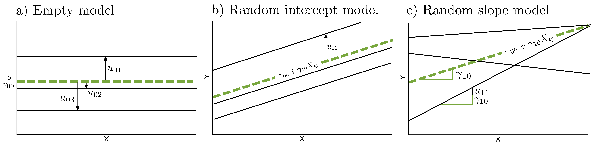

## Theoretical foundation of multilevel models

Populations in which units of interest (e.g., students, employees, or musicians) are grouped into higher-level units such as classes, firms, or ensembles, are common in the social sciences. Imagine, for example, that you are interested in the musical self-concept of young adults and whether it is related to how many hours they practice their instrument each week. To investigate this question, you collect data from several youth ensembles. You recruit 15 ensembles, each consisting of 10 players. Every player completes a questionnaire assessing their musical self-concept as well as their weekly practice time. At first glance, this seems like a simple data set of 150 individuals. At closer inspection, however, players from the same ensemble rehearse together, share teachers, and experience similar social and musical environments. Their responses may therefore be more similar within ensembles than between ensembles.

Data of this kind are called *nested* or *clustered* [@snijders, p. 7]. Such data for example arises from a multistage sampling process, in which groups are sampled first and individuals are subsequently sampled within these groups^[In this thesis, the terms 'groups' or 'clusters' refer to higher-level units, while lower-level units are referred to as 'persons', 'individuals' or 'observations'. These models can also be applied to longitudinal data, where measurement occasions are nested within individuals, and to data structures with more than two levels.]. This process induces dependencies in the data, as observations within the same group are not selected independently [@snijders, p. 7]. Beyond the sampling process, individuals within a group typically share contextual influences (e.g., the same ensemble teacher or classroom environment), which leads to increased similarity in their responses compared to individuals from another group. As a consequence, the assumption of independent errors in traditional linear models is violated, because residuals within groups are correlated [@raudenbush]. A widely used approach to account for this structure is the use of *multilevel models* (also referred to as *hierarchical linear models* or *mixed models*), which are introduced in the following section.

### The concept of multilevel regression models

The aim of regression analysis, whether single- or multilevel, is to explain variance in an outcome variable by including associated variables in the model as predictors [@snijders, p. 80]. In single-level regression, the residual $e_{i}$ captures the unexplained variance in $Y$, that is differences in the outcome from the prediction that the model made [@leonhart, p. 319]. To account for the dependency of the observations within groups, multilevel models extend this regular linear regression by adding level-2 random effects to explain the variability between groups that cannot be accounted for by predictors [@snijders, p. 80]. This partition of variance can be expressed in the multilevel regression model without predictors, the *empty model*:
$$
Y_{ij} = \gamma_{00} + u_{0j} + e_{ij}
$$
$Y_{ij}$ is the outcome value of person $i$ in group $j$, for $i = 1, ..., n_j$ ($n_j$ = number of observations in the group) and $j = 1, ..., N_2$ ($N_2$ = number of groups). This outcome is modeled as the sum of a fixed intercept parameter $\gamma_{00}$, a group-level random effect $u_{0j}$ and an individual-level residual, $e_{ij}$ [@snijders, p. 49]. The fixed intercept parameter $\gamma_{00}$ can be described as the overall mean in outcome $Y_{ij}$ across persons and groups. The random intercept $u_{0j}$ induces correlation in the outcome value between individuals within the same group, as all individuals in group $j$ have the same $u_{0j}$ value. Conditional on this group component, however, the remaining level-1 residuals $e_{ij}$ are assumed to be independent. In this way, the model explicitly accounts for the dependency of observations that would violate the assumptions of a single-level regression model. In @fig-mlmplots, the empty model is illustrated on the left side.

::: {#fig-mlmplots fig-scap="Common multilevel model specifications"}
{}

Schematic illustration of common multilevel model specifications in the level-1 coordinate space: empty model, random intercept model, and random slope model. The green line represents the fixed-effect prediction averaged across groups. The black lines represent exemplary groups and their deviations from the fixed effects. Individual-level observations are not displayed.
:::
### Level-1 and level-2 predictors in multilevel regression models

Predictors can then be included to explain variability at level 1 and level 2. At level 1, the outcome of a person $i$ in group $j$ is modeled as a function of individual-level explanatory variables $X_{ij}$. For simplicity, the level-1 equation is given with a single level-1 predictor:
$$
Y_{ij} =  \beta_{0j} + \beta_{1j}X_{ij} + e_{ij}
$$ {#eq-mlm}
In this equation, $\beta_{0j}$ is the intercept for group $j$, and $\beta_{1j}$ is the corresponding slope in group $j$. In a random slope model, each group is allowed to have its own intercept and slope. This model is illustrated on the right in @fig-mlmplots. The variation between groups in these coefficients is modeled at level 2, where $\beta_{0j}$ and $\beta_{1j}$ can be decomposed into *fixed effects*, representing the average coefficients across groups ($\gamma_{00}$ for the intercept and $\gamma_{10}$ for the slope), and group-specific *random effects*, representing deviations from these averages ($u_{0j}$ and $u_{1j}$, respectively; @snijders, p. 75). Without level-2 predictors, the level-2 equations are:
$$
\beta_{0j}
=
\underbrace{\gamma_{00}}_{\text{Fixed part}}
+
\underbrace{u_{0j}}_{\text{Random part}}
$$
$$
\beta_{1j}
=
\underbrace{\gamma_{10}}_{\text{Fixed part}}
+
\underbrace{u_{1j}}_{\text{Random part}}
$$
In order to explain between-group variability in the intercepts and slopes, level-2 predictors $Z_j$ may be included [@snijders, p. 80]. Including such predictors may reduce the unexplained variance of the random effects $u_{0j}$ and $u_{1j}$. With a single level-2 predictor, the model becomes:

$$
\beta_{0j}
=
\gamma_{00} + \gamma_{01}Z_{j}
+
u_{0j}
$$ {#eq-beta0j}

$$
\beta_{1j}
=
\gamma_{10} + \gamma_{11}Z_{j}
+
u_{1j}
$$ {#eq-beta1j}
Here, the level-2 predictor $Z_j$ is used to explain systematic between-group differences in the level-1 intercepts and slopes. The coefficient $\gamma_{01}$ represents the expected difference in the group-specific intercept $\beta_{0j}$ associated with a one-unit difference in $Z_j$. Similarly, $\gamma_{11}$ represents the expected difference in the group-specific slope $\beta_{1j}$ associated with a one-unit difference in $Z_j$. Thus, $\gamma_{11}$ describes a cross-level interaction: it indicates whether the association between the individual-level predictor $X_{ij}$ and the outcome $Y_{ij}$ differs depending on the group-level variable $Z_j$. The residual terms $u_{0j}$ and $u_{1j}$ represent remaining between-group variation in intercepts and slopes that is not explained by $Z_j$. Substituting the level-2 equations @eq-beta0j and @eq-beta1j into the level-1 equation @eq-mlm yields the combined multilevel model:

$$
Y_{ij} =
\underbrace{\gamma_{00} + \gamma_{10}X_{ij} + \gamma_{01}Z_{j} + \gamma_{11}X_{ij}Z_{j}}_{\text{Fixed part}}
+
\underbrace{u_{0j} + u_{1j}X_{ij} + e_{ij}}_{\text{Random part}}
$$
<<<<<<< HEAD
=======

>>>>>>> 426490d9852bda455816d1156db985fba4fd2f76
In many empirical applications of multilevel models, the slope $\beta_{1j}$ is assumed to be constant across groups, so that no random slope component is included ($u_{1j} = 0$). This leads to a *random-intercept model* [@snijders, p. 45]. In its simpler form, the model also does not include a cross-level interaction ($\gamma_{11} = 0$)^[A cross-level interaction can technically be included in a random-intercept model. However, this assumes that slope differences are modeled only as a systematic function of the level-2 predictor, without allowing for remaining unexplained slope variation. For this reason, cross-level interactions are usually discussed together with random slopes; see @heisig; @aguinis.]. This model allows for baseline differences in the outcome between groups, whereas the strength of the relationship between the level-1 predictor and the outcome is assumed to be constant across groups. This model is illustrated in the middle panel in @fig-mlmplots. The corresponding level-2 equations are:
$$
\beta_{0j} = \gamma_{00} + \gamma_{01}Z_j + u_{0j}
$$

$$
\beta_{1j} = \gamma_{10}
$$
The combined random-intercept equation therefore has only two random components, the group-level random effect $u_{0j}$ and the individual-level residual $e_{ij}$:
$$ 
Y_{ij} = \gamma_{00} + \gamma_{10}X_{ij} + \gamma_{01}Z_j + u_{0j} + e_{ij}
$$

### Distributional assumptions of the multilevel regression model
Similar distributional assumptions are typically made for the level-2 random effects as for the residuals in single-level regression: they have mean zero, constant variance across clusters, and are independent of each other across clusters and independent of the level-1 residuals. However, random effects within the same cluster - i.e. the random intercept $u_{0j}$ and random slope $u_{1j}$ - may be correlated and are often expected to do so [@snijders, p. 76]. Additionally, random effects are commonly assumed to follow a normal distribution for convenience, as it facilitates the likelihood-based estimation of the unknown parameters [@fahrmeir, p. 388]. For a model with both a random intercept and a random slope, these assumptions can be summarized by a bivariate normal distribution,
$$
\begin{aligned}
\begin{pmatrix}
u_{0j} \\
u_{1j}
\end{pmatrix}
&\sim \mathcal{N}
\left(
\begin{pmatrix}
0 \\
0
\end{pmatrix},
\mathbf{T}
\right),
\qquad
\mathbf{T} =
\begin{pmatrix}
\tau_0^2 & \tau_{01} \\
\tau_{01} & \tau_1^2
\end{pmatrix}
\end{aligned},
$$
where $\tau_0^2$ denotes the variance of the random intercepts across groups, and $\tau_1^2$ denotes the variance of the random slopes across groups. The covariance $\tau_{01}$ captures the association between random intercepts and random slopes within the same group. For example, a positive covariance would indicate that groups with higher-than-average intercepts also tend to have steeper-than-average slopes.

The level-1 residuals are typically assumed to be normally distributed with mean zero and constant variance ($\sigma^2$):

$$
e_{ij} \sim \mathcal{N}(0,\sigma^2)
$$
Furthermore they are assumed to be independent of the level-2 random effects:

$$
\text{Cov}(u_{0j}, e_{ij}) = 0, \qquad
\text{Cov}(u_{1j}, e_{ij}) = 0.
$$

### Contextual effects in multilevel models
As mentioned previously, individuals nested within the same group share a common context. In some cases, variables measured at the individual level may therefore be relevant in two different ways. First, they may describe how individuals differ from other individuals within the same group. Second, when aggregated to the group level, they may describe characteristics of the group context itself. Consider again the ensemble example, where students' practice duration was used to explain the musical self concept of students. A student who practices more than their peers may feel more competent and report a higher musical self-concept. But at the same time, students often compare their own practice behavior with that of other ensemble members; and students in ensembles where everyone practices a lot may feel less competent, because upward social comparisons become more likely. This leads to two possible hypotheses: 

1. Students who practice more than others in their ensemble tend to report a higher musical self-concept. 
1. Students in ensembles with a higher average practice time may report a lower musical self-concept.

\noindent This example illustrates why it can be important to distinguish within-group and between-group associations. The within-group association describes how individual deviations from the group mean are related to the outcome. The between-group association describes how differences between group means are related to the outcome. A contextual effect is present when the group-level aggregate is associated with the outcome after controlling for individual differences within groups [@raudenbush, p. 139]. A random-intercept model provides a convenient framework for such analyses. To disentangle these processes, group means of a level-1 predictor may be included in the model as additional level-2 predictors. To separate within- and between-group effects, the level-1 predictor is commonly group-mean-centered: Instead of using $X_{ij}$ directly, the centered predictor $(X_{ij} - \bar{X}_j)$ is entered into the model [@snijders, p.58]. A random intercept model including such a decomposition can be written like this^[The group mean $\bar{X}_{j}$ is treated as an observed (manifest) aggregate in this approach. Group means can also be modeled as latent variables, thereby accounting for measurement error and sampling variability [@luedtkecontext].]:
$$ 
Y_{ij} = \gamma_{00} + \gamma_{10}(X_{ij} - \bar{X}_{j}) + \gamma_{01}\bar{X}_{j} + u_{0j} + e_{ij}
$$ {#eq-RI}
In this model, the effect of weekly practice duration on $Y_{ij}$, the musical self-concept of student $i$ in ensemble $j$, is separated into the *within-group effect* $\gamma_{10}$, indicating how a student's own practice time relates to their musical self-concept while controlling for the ensemble context, and the *between-group effect* $\gamma_{01}$, indicating how the ensemble's average practice time relates to students' musical self-concept, controlling for individual deviations from the group mean. The difference between these two coefficients, $\gamma_{01}$-$\gamma_{10}$, represents the *contextual effect* [@raudenbush, p. 139]. For the remainder of this thesis, the focus lies on this particular random intercept model.

### The intraclass correlation coefficient (ICC)

In the random intercept model, the variance components are given by
$$
u_{0j} \sim \mathcal{N}(0,\tau_0^2),
\qquad
e_{ij} \sim \mathcal{N}(0,\sigma^2),
\qquad
\text{Cov}(e_{ij}, u_{0j}) = 0 .
$$
From these variance components, the proportion of variability that is attributable to between-group differences can be calculated. This quantity is referred to as the *intraclass correlation coefficient* (ICC). In the empty model, the ICC is equal to the correlation between the outcomes of two randomly chosen individuals from the same group [@snijders, p. 18].
In models including predictors, the ICC is interpreted conditionally on the predictors, that is, as the correlation between two individuals from the same group who share identical predictor values (also referred to as the *residual ICC*) [@snijders, p. 52]. Formally, the ICC in a random intercept model is defined as 
$$
ICC = \frac{\tau_0^2}{\tau_0^2 + \sigma^2}
$$
The ICC is an important diagnostic metric because it indicates the extent to which residual variance in $Y_{ij}$ is attributable to differences between groups. If ICC = 0, no residual between-group variance is estimated in the model. Larger ICC values, in contrast, indicate increasing similarity of observations within groups and hence stronger statistical dependency. Ignoring this dependency and applying a classical linear model can lead to biased standard errors, confidence intervals, and hypothesis tests [@aarts; @fahrmeir, p.370].

### Estimation of parameters in multilevel models {#sec-est}
The random intercept model is defined by the fixed effects $\gamma$ and the variance components of the random effects, $\sigma^2$ and $\tau_0^2$ [@snijders, p. 60]. In practice, however, these model parameters are unknown and must be estimated from the observed data. In many applications, including the contextual-effect setting considered in this thesis, substantive hypotheses primarily concern fixed effects. In the ensemble example introduced above, for instance, the within- and between-group associations between practice time and musical self-concept would be represented by fixed-effect parameters. The variance components are nevertheless essential, because they influence the estimated uncertainty of the fixed-effect estimates. Based on the resulting parameter estimates, their estimated uncertainty, and assumptions about the sampling distribution of the estimators, inferences about the corresponding population parameters are drawn [@raudenbush, p. 57f.].
The steps of this process are illustrated in more detail in @fig-est. Aspects of the observed data may pose challenges to the reliable performance of this 'inferential machinery'. Two central challenging aspects, namely small sample sizes and missing data, will be discussed in the following chapters.

:::{#fig-est fig-scap="Frequentist inferential process in a random intercept model"}

Schematic representation of the frequentist inferential process in a random intercept model, based on @snijders and @raudenbush.
\small
In the first step, fixed effects and variance components are estimated from the observed data, commonly using maximum likelihood (ML) or restricted maximum likelihood (REML) estimation. The estimated random-intercept variance $\hat{\tau}_0^2$ and residual variance $\hat{\sigma}^2$, together with the random-effects design matrix $Z$, determine the estimated variance-covariance matrix of the outcome vector, $\hat V$. In the random-intercept model, $Z$ encodes group membership and thereby represents that observations from the same group share the same random intercept. The estimated uncertainty of the fixed-effect estimates is then derived from $\hat V$ and the fixed-effects design matrix $X$. This matrix contains one row for each observation and columns for the fixed-effect terms in the model. For a given fixed effect $\hat{\gamma}_k$, the corresponding standard error quantifies the estimated sampling variability of the estimator. The point estimate and its standard error are used to form a test statistic, which is evaluated against an assumed sampling distribution to obtain $p$-values and confidence intervals. Thus, frequentist inference for fixed effects depends not only on the point estimates themselves, but also on the estimated variance components and on assumptions about the sampling distribution of the estimators.
\normalsize
:::

## Small sample sizes in multilevel models {#sec-small}

Frequentist estimation procedures for linear multilevel models typically rely on large-sample (asymptotic) theory. In multilevel models, the number of groups is particularly important. Consider again the musical self-concept study with 150 students nested in 15 ensembles. Although 150 participants may seem like a reasonably large sample, the number of ensembles is still small. Information about between-ensemble variation and level-2 effects is therefore based on only 15 higher-level units. Simulation studies suggest that approximately 25–30 clusters are often required for reliable estimation, depending on the model specification and the parameters of interest [@mcneishstaple14; @mcneish17; @maashox], but this is often difficult to achieve because recruiting a large number of groups can be challenging and costly. When the number of groups is small, several components of the inferential procedure may perform poorly if no corrections are used, particularly the estimation of level-2 variance components, the calculation of standard errors, and the approximation of degrees of freedom for fixed-effect tests [@mcneishcoll; @maashox; @elff].

<<<<<<< HEAD
\noindent **Estimation of coefficients and variance components.** For correctly specified linear multilevel models, ML estimates of fixed effect coefficients are unbiased under quite general conditions [@kackar; @elff, Appendix A.3]. Importantly, this unbiasedness result does not depend on the level-1 or level-2 sample size and a small number of groups therefore does not in itself imply biased fixed-effect point estimates. The estimation of variance components, however, is more delicate. In ML estimation, fixed effects and variance components are estimated from the same likelihood, typically via iterative procedures like the Expectation Maximization (EM) algorithm [@raudenbush, p. 52]. This leads to systematic underestimation of variance components in small samples, because the uncertainty about the fixed effects is not accounted for [@raudenbush, p. 53]. REML addresses this issue by separating the estimation conceptually, which leads to less downward-biased variance component estimates, while ML and REML become asymptotically equivalent as sample size increases [@mcneishcoll]. Nevertheless, even under REML, the estimated variance of the fixed-effect estimators may still be too small in small samples for two reasons. First, the variance formula treats the estimated variance components $\hat{\theta}$ as known and therefore ignores their sampling variability [@kackarcorr]. Second, the REML variance expression itself relies on asymptotic approximations [@mcneishcoll]. Both issues can lead to underestimated standard errors. Several small-sample corrections have been proposed to address these additional problems, among which the Kenward–Roger procedure is one of the most widely used [@mcneishcoll].
=======
**Estimation of coefficients and variance components.** For correctly specified linear multilevel models, ML estimates of fixed effect coefficients are unbiased under quite general conditions [@kackar; @elff, Appendix A.3]. Importantly, this unbiasedness result does not depend on the level-1 or level-2 sample size and a small number of groups therefore does not in itself imply biased fixed-effect point estimates. The estimation of variance components, however, is more delicate. In ML estimation, fixed effects and variance components are estimated from the same likelihood, typically via iterative procedures like the Expectation Maximization (EM) algorithm [@raudenbush, p. 52]. This leads to systematic underestimation of variance components in small samples, because the uncertainty about the fixed effects is not accounted for [@raudenbush, p. 53]. REML addresses this issue by separating the estimation conceptually, which leads to less downward-biased variance component estimates, while ML and REML become asymptotically equivalent as sample size increases [@mcneishcoll]. Nevertheless, even under REML, the estimated variance of the fixed-effect estimators may still be too small in small samples for two reasons. First, the variance formula treats the estimated variance components $\hat{\theta}$ as known and therefore ignores their sampling variability [@kackarcorr]. Second, the REML variance expression itself relies on asymptotic approximations [@mcneishcoll]. Both issues can lead to underestimated standard errors. Several small-sample corrections have been proposed to address these additional problems, among which the Kenward–Roger procedure is one of the most widely used [@mcneishcoll].
>>>>>>> 426490d9852bda455816d1156db985fba4fd2f76

\noindent **Choice of degrees of freedom.** REML estimation and small-sample adjustments such as Kenward–Roger can reduce some of the inferential problems described above. However, inference also requires choosing an appropriate reference distribution for test statistics and confidence intervals. In small samples, a $t$-distribution is typically recommended instead of a standard normal distribution [@snijders, p. 95]. Its shape is determined by the degrees of freedom, which can be understood as the amount of independent information remaining after accounting for estimated parameters [@pandey]. In multilevel models, degrees of freedom generally cannot be calculated exactly and must therefore be approximated [@snijders, p. 95]. Different approximations are available. For example, the Kenward–Roger procedure includes a small-sample approximation of the degrees of freedom based on the Satterthwaite method [@mcneishcoll]. A simpler approximation, described by Raudenbush & Bryk [-@raudenbush, p. 58], Snijders & Bosker [-@snijders, p. 95], and Elff et al. [-@elff], follows the general idea of degrees of freedom as information minus estimated parameters. For level-1 coefficients, the degrees of freedom are approximated by the total number of level-1 observations minus the number of level-1 predictors and the intercept. For level-2 coefficients, the degrees of freedom are approximated by the number of level-2 units minus the number of level-2 predictors and the intercept:
$$
df_{Lv1} = N_1 - r - 1, \qquad df_{Lv2} = N_2 - q - 1
$$ {#eq-df}
where $N_1$ is the total number of level-1 observations, $N_2$ is the number of level-2 units, $r$ is the total number of predictors, and $q$ is the number of level-2 predictors.

\noindent **Bayesian estimation as an alternative.** As an alternative to the frequentist framework predominantly presented here, Bayesian estimation is often recommended for small samples [@mcneishbay; @depaoli; @vandeschoot; @kadane]. Unlike frequentist inference based on asymptotic sampling distributions, Bayesian inference represents uncertainty through posterior distributions and therefore does not rely on small-sample corrections for standard errors or degrees of freedom [@mcneishbay]. The incorporation of prior information about parameters may further improve estimation accuracy when the data provide limited information [@gelmanbook, p. 355; @smid]. Bayesian estimation will be revisited below in the context of missing data.

## Missing data in multilevel models
In the study about musical self-concept, you could find after data collection that some students in several ensembles did not report how many hours they practice per week. They completed the questionnaire on musical self-concept but left the practice question blank. The reason for this is unknown: they might have forgotten to answer the question, skipped it intentionally, or misunderstood it. Regardless of the reason, the data set now contains missing values. How should these missing observations be handled in the analysis?

Missing data (i.e., incomplete data sets) are a widespread issue in empirical research and of course also apply to multilevel data, for example, because individuals drop out of studies or forget to fill out certain items of a questionnaire. Three major concerns commonly arise from data that contain missing values [@luedtke]:

1. The effective sample size is reduced, leading to lower efficiency in estimation (this is especially troublesome if the would-be sample size is already small)
1. Typical statistical methods are difficult to conduct, because they were designed for complete data.
1. Parameter estimation may be biased, if the missing and the observed data differ from each other systematically  

Therefore, it is crucial to treat missing data appropriately. In the last three decades, this issue has received attention in psychological research, and modern methods were developed [@SG2002; @endersbook], more recently also for the more complex case of multilevel data [@luedtkeMI; @endersupdate]. This chapter discusses these methods, after giving a short introduction into different missing data mechanisms and patterns.

### Missing data mechanisms
<<<<<<< HEAD
=======

Missing values may arise for different reasons, and different missing-data mechanisms can have different consequences for statistical inference. Rubin [-@rubin76] introduced the formal framework for these mechanisms, which was later systematized in Little and Rubin's textbook [-@little20]. These mechanisms also apply to multilevel data, but the situation becomes more complex because missing values can occur in the outcome, in level-1 predictors, in level-2 predictors, in the grouping variable, or in combinations of these variables [@buuren]. The missing-data mechanism is generally not empirically testable from the observed data alone; assumptions about the mechanism must therefore be theoretically justified [@endersbook, pp. 14-17].
>>>>>>> 426490d9852bda455816d1156db985fba4fd2f76

Missing values may arise for different reasons, and different missing-data mechanisms can have different consequences for statistical inference. Rubin [-@rubin76] introduced the formal framework for these mechanisms, which was later systematized in Little and Rubin's textbook [-@little20]. These mechanisms also apply to multilevel data, but the situation becomes more complex because missing values can occur in the outcome, in level-1 predictors, in level-2 predictors, in the grouping variable, or in combinations of these variables [@buuren]. The missing-data mechanism is generally not empirically testable from the observed data alone; assumptions about the mechanism must therefore be theoretically justified [@endersbook, pp. 14-17].

\noindent **Missing completely at random (MCAR)**. The hypothetical complete data matrix $Y_{com}$ can be partitioned into observed, $Y_{obs}$, and missing parts, $Y_{mis}$. $R$ denotes the missingness^[$R$ is treated as a set of random variables that indicate for each value if it is missing or not [@SG2002].]. Missing values are considered to be MCAR if the distribution of missingness is independent of both the observed and the unobserved data [@SG2002]:
$$
P(R \mid Y_{com}) = P (R)
$$
In other words, no variable (observed or unobserved) is predictive of missingness and every individual has the same chance of missing values [@endersbook, p. 6].

\noindent **Missing at random (MAR)**. The MAR mechanism describes the case when the probability of missingness may depend on observed data, but not on the unobserved values themselves once the observed data are taken into account [@endersbook, p.8]:
$$
P(R \mid Y_{com}) = P (R \mid Y_{obs})
$$
Missingness is therefore not random, as the name would suggest, but *conditionally random*: After controlling for the observed data, the missingness is purely random [@endersbook, p. 8]. For example, younger students may be more likely to skip the question on weekly practice duration, for instance due to reduced concentration toward the end of the questionnaire. If age is fully observed and included in the missing-data procedure, the MAR mechanism may be plausible.

\noindent **Missing not at random (MNAR)**. If missingness depends on unobserved values, this is called a missing not at random process:
$$
P(R \mid Y_{com}) = P (R \mid Y_{obs}, Y_{mis})
$$
Two individuals with identical scores in all observed variables therefore no longer have the same chance of missing values, because this chance depends on the unavailable, missing information itself [@endersbook, p. 11]. For example, students who practice less may be more likely to skip the question on weekly practice duration. If no observed variables can account for this behavior, missingness depends on the practice duration itself, which represents a MNAR mechanism.

The approaches mentioned in this thesis generally rely on the assumption that data are MAR. Methods for dealing with MNAR processes are not discussed in this thesis.

### Methods for handling missing data
Many estimation procedures require complete data. Therefore, missing data must be handled explicitly before model estimation. If researchers do not actively specify a method, statistical software often defaults to using only complete observations [@luedtke]. This simple ad hoc procedure is called *listwise deletion* (LD) or *complete case analysis*. Cases with at least one missing value are discarded, and the model is estimated using only complete observations [@graham09]. In multilevel settings, missingness on the group level implies that all individuals in this group are excluded as well.

LD is generally not recommended, because parameter estimates can be substantially biased when missingness is not MCAR. In addition, partial data are unused, which reduces statistical power [@endersbook, p.24]. More modern and better-performing methods are available and will be introduced in the following sections. These approaches can be broadly divided into two classes:  
<<<<<<< HEAD
1. *Model-based approaches* to missing data base parameter estimation and inference directly on the incomplete data, for example via the observed-data likelihood or the posterior distribution [@little20, p.25].  
=======
1. *Model-based approaches* to missing data base parameter estimation and inference directly on the incomplete data, for example via the observed-data likelihood or the posterior distribution [@little20, p.25]. 
>>>>>>> 426490d9852bda455816d1156db985fba4fd2f76
2. *Imputation-based approaches* first replace missing values by one or more plausible values, creating one or more completed data sets that can then be analyzed using standard complete-data methods.

#### Multiple Imputation
Multiple imputation (MI) is an imputation-based method, as the name suggests. The basic idea is to replace missing values with plausible draws ("imputations") from their predictive distribution. The substantive analysis model is then fitted to the imputed data. In order to include the uncertainty due to missing values, in MI several imputations for each missing observation are generated. By incorporating the variance between these imputations, the additional uncertainty can be captured [@endersbook, p.283]. The analysis of incomplete data is separated into three steps: imputation, analysis, and pooling.

\noindent **Creating imputations.** Imputations can be understood as “predicted values plus noise” [@endersbook, p.266]. That is, missing values are replaced by plausible values drawn from an imputation model, so that the resulting completed data sets reflect both the predicted value and uncertainty around this prediction [@murray]. A finite number, usually between $m$ = 20 and $m = 100$ [@graham07] of imputations is saved, leading to $m$ completed data sets. The imputation model can either be specified jointly for all variables (*joint imputation*) or individually (*fully conditional specification*). Both approaches can be extended to multilevel data structures [@enders16], but in this thesis, only joint imputation is considered. In this approach, a single multivariate distribution for all variables with missing values is specified, often the multivariate normal distribution for continuous variables [@endersbook, p.263]. 
 
\noindent **Specifying the imputation model.** 
A crucial point in the choice of a valid imputation model is compatibility with the focal analysis model that is used later on. That is, the imputation model must reflect the key structural features of this analysis model [@meng; @grundMI18]. At the same time, the imputation model is allowed to be richer than the analysis model. Including additional effects or variables that are not part of the analysis model as *auxiliary variables*^[Auxiliary variables are variables whose only purpose is to improve the missing-data imputation [@collins].] is considered beneficial for parameter estimation [@collins; @schafer03]. These variables may either be causes of missingness, thereby making the missing at random (MAR) assumption more plausible, or they may correlate with variables that contain missing values, which can increase the precision of the imputations and reduce bias in parameter estimates [@collins]. 

For a random-intercept analysis model, the *multivariate empty model* generally represents a suitable joint imputation model. In this approach, all level-1 and level-2 variables included in the imputation model are treated as outcomes, and their variances and covariances are decomposed into between- and within-group components without specifying predictors [@grundMI16]. In this way, the multilevel structure of the data and the associations among variables at the respective levels are preserved. This also provides the relevant within- and between-group information for a random-intercept model with a contextual effect. For the model introduced in @eq-RI, an appropriate joint imputation model with one additional level-2 variable can be written as:

$$ 
\left(
\begin{matrix}
Y_{ij} \\
X_{ij} \\
W_j
\end{matrix}
\right)
=
\left(
\begin{matrix}
\beta_{0Y} \\
\beta_{0X} \\
\beta_{0W}
\end{matrix}
\right)
+
\left(
\begin{matrix}
u_{Yj} \\
u_{Xj} \\
u_{Wj}
\end{matrix}
\right)
+
\left(
\begin{matrix}
e_{Yij} \\
e_{Xij} \\
0
\end{matrix}
\right)
$$ {#eq-imputationmodel}
$W_j$ represents a level-2 variable and therefore has no level-1 residual term. If $W_j$ is not included in the analysis model, it can serve as an auxiliary variable. For example, in the musical self-concept study, the years of teaching experience of the ensemble teachers might be available. Although this variable is not part of the subsequent analysis model, it may correlate with practice behavior or musical self-concept and could therefore serve as an auxiliary level-2 variable. The random effects and residuals are assumed to follow multivariate normal distributions:
$$
\left(
\begin{matrix}
u_{Yj} \\
u_{Xj} \\
u_{Wj}
\end{matrix}
\right)
\sim N(0,\Psi),
\qquad
\left(
\begin{matrix}
e_{Yij} \\
e_{Xij}
\end{matrix}
\right)
\sim N(0,\Sigma)
$$
where the covariance matrix $\Psi$ captures the between-group variability and covariation of the random intercepts and $\Sigma$ represents the within-group covariance structure of the level-1 residuals:

$$
\Psi =
\left[
\begin{matrix}
\psi_y^2 & \psi_{yx} & \psi_{yw} \\
\psi_{yx} & \psi_x^2 & \psi_{xw} \\
\psi_{yw} & \psi_{xw} & \psi_w^2
\end{matrix}
\right],
\qquad
\Sigma =
\left[
\begin{matrix}
\sigma_y^2 & \sigma_{yx} \\
\sigma_{yx} & \sigma_x^2
\end{matrix}
\right].
$$
**Analyzing the completed data sets and pooling the results.** After the imputation step, researchers are in the comfortable position to have *m* completed data sets that can be analyzed using standard frequentist methods. To each of the data sets, the substantive analysis model of interest (e.g., the random intercept model) is now fitted. Each analysis proceeds according to the standard estimation procedure described in @sec-est, up to the computation of parameter estimates and their standard errors.
Hypothesis testing is not conducted at this stage. The result of this step is a set of *m* parameter estimates and corresponding standard errors. These *m* estimates and standard errors are aggregated into a single set of results following Rubin's pooling rules [@rubinbook87]. He defined the point estimates of effects as the arithmetic average of the $m$ estimates:

$$
\hat{\theta} = \frac{1}{m}
\sum_{k=1}^{m}
\hat{\theta}_k
$$
Here, $\hat{\theta}$ is the pooled point estimate, and $\hat{\theta}_k$ is the estimate from data set $k$ ($k=1, ...,m$).  

For the pooled standard errors, both the within-imputation variance and the between-imputation variance are combined. The within-imputation variance is based on the complete-data sampling variance within each imputed data set and is calculated as the arithmetic mean of the squared standard errors, denoted by $SE_k$, across the $m$ analyses:

$$
\bar{V}_w
=
\frac{1}{m}
\sum_{k=1}^{m}
SE^2_k
$$
The between-imputation variance is defined as the variance of point estimates between imputations that is due to uncertainty caused by the missing values:

$$
V_b
=
\frac{1}{m-1}
\sum_{k=1}^{m}
(\hat{\theta}_k - \hat{\theta})^2
$$
The total pooled standard error combines the within-imputation variance $\bar{V}_w$ and the between-imputation variance $V_b$:
$$
SE
=
\sqrt{
\bar{V}_w
+ V_b
+ \frac{V_b}{m}}
$$
The third term in this expression acts as a correction factor for using a finite number of imputations [@endersbook, p. 284]. As the number of imputations $m$ increases, this correction term approaches zero. 
With an appropriate point estimate and standard error, the remaining step (see @fig-est) is the choice of the sampling distribution.
Rubin proposed a calculation method for degrees of freedom of the t-distribution, that is based on the relative increase of variance due to missing values RIV ($RIV = \frac{(1 + 1/m)V_b}{\bar{V}_w}$) and the number of imputations $m$:
$$
df_R
=
(m-1)
\left(
1+\frac{1}{RIV^2}
\right)
$$
This formula assumes that the degrees of freedom of the complete data are effectively infinite [@barnard]. In smaller samples, the classic Rubin formula therefore tends to produce degrees of freedom that are too large, sometimes even larger than the degrees of freedom of the complete data.
Barnard and Rubin [-@barnard] thus proposed a small-sample-adjusted degrees-of-freedom calculation for pooled parameters. Their formula downweights the complete-data degrees of freedom to account for the uncertainty due to missing values. As the complete-data degrees of freedom cannot easily be obtained for multilevel analyses, a suitable degrees-of-freedom approximation must be chosen for the analysis. Possible approaches include the methods described in @sec-small, but a specific recommendation for multilevel models does not exist.

#### Full Information Maximum Likelihood (FIML)

Full information maximum likelihood (FIML) is a model-based approach in which parameter estimates are obtained directly by maximizing the likelihood of the observed data [@endersbook, p. 98]. Under the assumption that data are missing at random (MAR), FIML yields unbiased and efficient parameter estimates [@mcneish17].  Incorporating auxiliary variables is less straightforward in FIML than in multiple imputation. Nevertheless, several approaches have been proposed to include auxiliary information in FIML estimation, such as the saturated correlates model or the extra dependent variable approach [@grahamFIML], as well as the factored regression framework described below for the Bayesian missing-data approaches.

For the random intercept model with group-mean effects considered in this thesis, FIML is not always well suited when missingness occurs in predictor variables. In such cases, maximum likelihood estimation requires additional distributional assumptions about the distribution of the predictors in order to incorporate them into the likelihood function [@grundMI18]. In multilevel models with manifest group means, these assumptions may lead to biased estimates of between-group effects [@grundapa].

#### Fully Bayesian Estimation
A Bayesian framework can naturally be applied to missing-data problems. In contrast to the two-step procedure of multiple imputation, Bayesian missing-data analysis directly uses the posterior distribution of the model parameters conditional on the observed data for statistical inference. Missing values are treated as additional unknown quantities. To simulate these values during estimation, a model for the variables with missing data must be specified. A convenient way to specify the joint distribution of the outcome and the variables with missing values is to apply the probability chain rule and express the joint distribution as a product of conditional distributions, which is referred to as *sequential specification* or *factored regression specification* [@luedtke20]:

$$ 
g\left(y,\ x;\gamma\right)=g_y\left(y \middle| x;\gamma_y\right) \times g_x(x;\gamma_x)
$$ 
where $\gamma = (\gamma_y, \gamma_x)$ denotes the vector of all model parameters. Here, the joint density is decomposed into two components. The first term $g_y(y \mid x; \gamma_y)$ corresponds to the density implied by the analysis model, describing the conditional distribution of the outcome given the covariate $X$. 
The second term $g_x(x; \gamma_x)$ specifies a model for the distribution of the covariate $X$. Each conditional distribution in a sequential modeling framework is typically specified as a regression model. Consequently, the implied joint distribution is constructed from a sequence of conditional models, each imposing its own distributional assumptions.

An advantage of this formulation is its flexibility: it allows the inclusion of variables with different measurement scales and facilitates the use of auxiliary variables that are not part of the substantive analysis model [@erler; @daniels]. For example, auxiliary variables such as $W_j$ may be included to improve the imputation of missing values while the substantive model of interest is still estimated without $W_j$. For this purpose, auxiliary variables can be placed in the first position of the factored regression, so that the analysis variables predict the auxiliary variables [@endersbook, p. 215]:

$$ 
g\left(y,\ x,w;\gamma\right)=g_w\left(w\middle| y,x;\gamma_w\right) \times g_y\left(y\middle| x;\gamma_y\right) \times g_x(x;\gamma_x)
$$ {#eq-frs}
Because all missing values are resampled in each iteration, the uncertainty due to missing data is automatically included in the posterior distribution [@erler]. 

### Present study

Both challenges considered here — small sample sizes and missing data — often co-occur in empirical research, but missing-data methods have rarely been investigated in small-sample settings. 
For multiple imputation, some studies suggest that small-sample adjustments applied during pooling may improve inferential performance in both single-level and multilevel contexts [@mcneish17; @mcneishgrowth]. However, these adjustments have not been compared to standard inferential approaches based on unadjusted degrees of freedom, and the models considered did not incorporate contextual predictors. Fully Bayesian estimation may offer a promising model-based alternative to MI, as it naturally accommodates both missing predictor values and small sample sizes. It is often recommended in more complex multilevel models, for example in the presence of nonlinearities or interaction effects [@depaoli; @endersmodel; @muthen12]. However, it may also represent a suitable alternative to likelihood-based approaches such as FIML in simpler models with contextual effects, where the handling of missing predictor variables and the construction of group means may lead to biased estimates [@grundapa]. To evaluate this, the present study uses a simulation design to compare methods for handling missing data in a predictor variable in a small-sample multilevel random intercept model. In particular, it examines whether applying a small-sample-adjusted degrees-of-freedom approximation with the $N_2 - q - 1$ heuristic (@eq-df) after multiple imputation improves inferential performance, and whether fully Bayesian estimation provides a suitable alternative to imputation-based or likelihood-based approaches.

Simulation studies can be understood as computer experiments, in which data with known characteristics are generated and then analysed using the methods of interest [@morris]. Because the true parameter values are known, the resulting estimates can be compared with the truth, allowing the performance of the methods to be evaluated [@siepe]. The simulation design and evaluation criteria are described in the following chapter.
